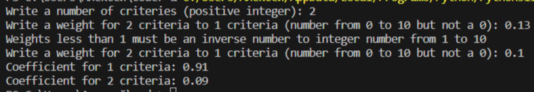
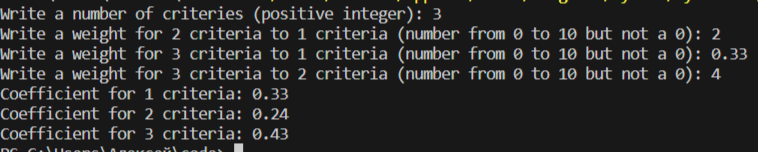
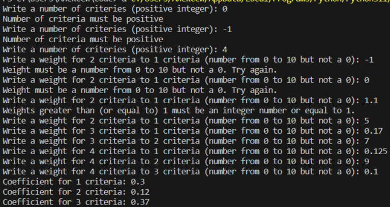

# Applied Coding 6
## Исполнитель    
Фадеев Алексей    
группа ФТ-220007    
## Лабораторная работа №6 - Метод анализа иерархий    
Написать на любом языке программу, реализующую метод анализа иерархий Томаса Саати для одного уровня.    
Задание * - Разработать графический интерфейс.    
## Среда разработки    
Язык программирования: Python.    
Среда разработки: Visual Studio Code.    
## Инструкция по работе    
Входные данные: количество критериев, данные попарного сравнения критериев (запрашивать попарно).    
Выходные данные: весовые коэффициенты в виде 0.00.    
## Тесты    
Тест 1    
    
Тест 2    
    
Тест 3    

